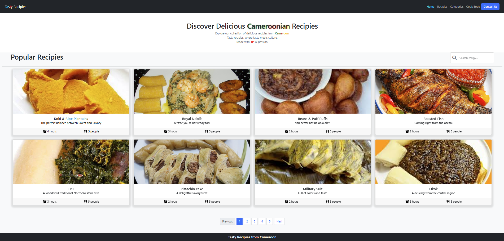

# Tasty Recipes from Cameroon

## 🌟 What This Project Does

This project is a delightful static website that showcases a collection of mouth-watering recipes from Cameroon. It features popular traditional dishes like Koki & Ripe Plantains, Royal Ndolè, Beans & Puff Puffs, and more. The site provides an engaging way to explore Cameroonian cuisine, complete with recipe cards displaying preparation time, serving sizes, and enticing descriptions.

## 🎯 The Goal

As someone from Cameroon, this project is very dear to my heart. My homeland's rich culinary heritage is something I'm passionate about sharing with the world. Through this website, I aim to introduce people to the vibrant flavors, cultural significance, and warmth of Cameroonian cooking. Each recipe tells a story of tradition, community, and the joy of sharing meals with loved ones. I'm thrilled to bridge cultures and bring a taste of Cameroon to your kitchen!

## 🛠️ Tools Used

This project is built using modern web technologies with a strong emphasis on **Bootstrap** for responsive design and user experience:

- **HTML5**: For structuring the content and layout
- **CSS3**: For custom styling and visual enhancements
- **Bootstrap 5.3.8**: The core framework that powers the responsive grid system, navigation bar, cards, and overall layout. Bootstrap ensures the site looks great on all devices, from mobile phones to desktops, without complex custom CSS
- **FontAwesome**: For beautiful icons like cooking utensils and clocks
- **CDN Links**: For efficient loading of Bootstrap and FontAwesome resources

## 🚀 How to Run the Project

Running this project is simple since it's a static website:

1. Clone or download the project files to your local machine
2. Open the `index.html` file in any modern web browser (Chrome, Firefox, Safari, Edge, etc.)
3. The website will load instantly and you can browse the recipes

No server setup, installation, or build process is required!

## 📸 Preview

The website features a clean, modern design with:
- A dark navigation bar with links to Home, Recipes, Categories, Cook Book, and a Contact Us button
- A welcoming hero section with colorful text shadows highlighting "Cameroonian Recipes"
- A search bar for finding specific recipes
- Recipe cards in a responsive grid layout, each showing:
  - High-quality food images
  - Recipe titles and taglines
  - Cooking time and serving size information
  - Hover effects and smooth animations

Here's what the page looks like:

## 💡 Improvement Ideas

Here are some exciting ways to enhance this project:

- **Add More Recipes**: Expand the collection with additional Cameroonian dishes and detailed recipe instructions
- **Interactive Features**: Implement a recipe detail page with full ingredients lists and step-by-step cooking instructions
- **User Contributions**: Add a form for visitors to submit their own family recipes
- **Multilingual Support**: Include French translations since Cameroon is bilingual
- **Backend Integration**: Connect to a database for dynamic content and user accounts
- **Mobile App**: Develop a companion mobile app for on-the-go recipe browsing
- **Video Tutorials**: Embed cooking demonstration videos for each recipe
- **Cultural Context**: Add stories and cultural significance for each dish
- **Shopping Integration**: Link to ingredients for easy online purchasing

## 📝 Important Note

The images used in this project are sourced from various online locations and I do not own the copyright or rights to these images. They are used for educational and demonstrative purposes only. If you plan to use this project commercially or redistribute it, please ensure you have proper licensing for any images you include.

---

Made with ❤️ from Cameroon to the world! 🇨🇲
